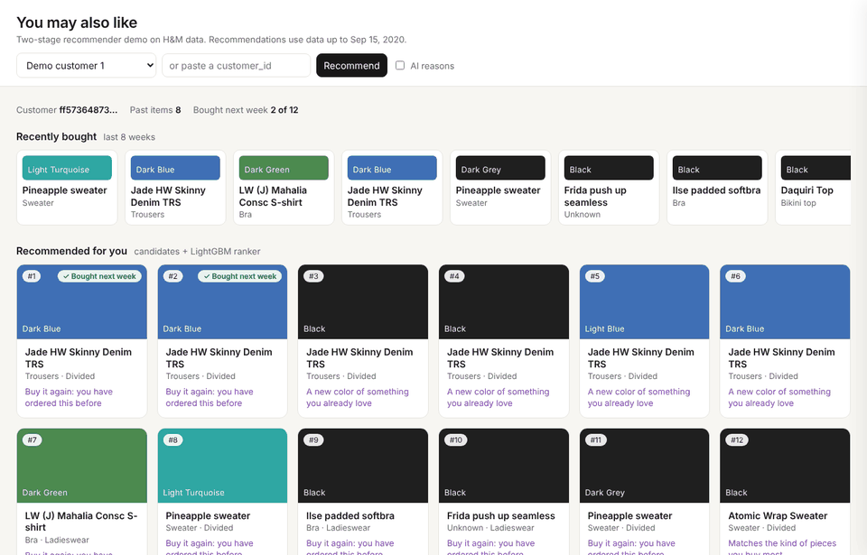

# H&M Product Recommender

**Capstone project, Pillar 5 (eCommerce: recommend products to users)** · Matthew Martinez

A two-stage recommender that picks the 12 products each customer is most likely to buy next week, built on the public [H&M Personalized Fashion Recommendations](https://www.kaggle.com/competitions/h-and-m-personalized-fashion-recommendations) data. It covers the full ML lifecycle: framing, data checks, EDA, feature engineering, model comparison, explainability, a bias audit, a FastAPI service and a GenAI layer that writes a one-line reason for each recommendation.



## Results (test week 16 to 22 Sep 2020, 14,023 customers, never used in training or tuning)

| Model | MAP@12 | Recall@12 | Hit rate | AUC |
|---|---|---|---|---|
| Best sellers last week (baseline) | 0.0094 | 0.0284 | 7.1% | |
| Buy again (repurchase) | 0.0263 | 0.0557 | 11.2% | |
| Logistic regression ranker | 0.0293 | 0.0620 | 12.0% | 0.730 |
| **LightGBM classifier ranker (selected)** | **0.0309** | **0.0663** | **13.1%** | **0.758** |
| LightGBM LambdaRank | 0.0312 | 0.0648 | 12.7% | 0.756 |

The LightGBM classifier was picked on the validation week. On the test week it scores **3.3x the best-seller baseline** on MAP@12 and finds at least one real purchase for 13.1% of shoppers (vs 7.1%). LambdaRank ties it on MAP@12 but is behind on recall, hit rate and AUC.

Full write-up: [`reports/final_report.pdf`](reports/final_report.pdf) · Decks: [`reports/technical_deck.pdf`](reports/technical_deck.pdf), [`reports/business_deck.pptx`](reports/business_deck.pptx)

## How it works

```
8 weeks of history ──► Stage 1: 7 candidate generators ──► ~80 items per customer
                        popularity · age-band popularity · buy again ·
                        item-to-item CF · ALS · PCA content-based · other colors
                                         │
                                         ▼
                        50 features (customer, item, customer x item, generator scores)
                                         │
                                         ▼
                        Stage 2: LightGBM ranker ──► top 12 + "why this item" line
```

## Repository layout

```
├── configs/config.yaml        all settings: dates, sample rule, weeks, sizes, tuning, fairness
├── data/                      raw/ and processed/ (not in git, see data/README.md)
├── demo/                      demo GIF and screenshots
├── docs/                      data dictionary, deployment guide, GenAI notes, model card
├── models/                    saved rankers, feature list, tuned params, test metrics
├── notebooks/                 01 data → 02 EDA/features → 03 models → 04 explainability/fairness → 05 GenAI/serving
├── reports/                   final report, decks, figures/, tables/
├── src/recsys/                package: data, candidates, features, ranker, evaluate, fairness, explain, genai, serving, api
├── tests/                     unit tests (run in CI)
├── Dockerfile, Makefile, requirements*.txt, pyproject.toml
└── .github/workflows/ci.yml   lint + tests on every push
```

## Reproduce

```bash
python -m venv .venv && source .venv/bin/activate
pip install -r requirements.txt && pip install -e .
```

1. Download `articles`, `customers` and `transactions_train` from Kaggle (accept the competition rules first) into `data/raw/`. The parquet copy [derrickmwiti/hm-personalized-fashion-recommendations](https://www.kaggle.com/datasets/derrickmwiti/hm-personalized-fashion-recommendations) works and is about 1 GB.
2. Run the pipeline:

```bash
make sample   # last 13 weeks, ~20% of customers (fixed rule, no randomness)
make tables   # candidates + features for weeks 0 to 4
make train    # tune, train, evaluate, log to MLflow, save to models/
make serve    # batch-score customers for the API
make api      # http://localhost:8000  (docs at /docs)
make test     # unit tests
```

3. Or open the notebooks in order. They read the cached tables, so each one runs in a few minutes.

Seeds, the sample rule, week split and every size live in `configs/config.yaml`. Each training run is logged to MLflow (`mlflow ui --backend-store-uri sqlite:///mlruns/mlflow.db`).

## Highlights

- **Leakage-safe time split**: features only use the 8 weeks before each target week; weeks 2 to 4 train, week 1 tunes, week 0 tests
- **Explainability**: exact TreeSHAP (global, dependence, per-item waterfall), PDP and ICE
- **Bias audit**: recommendation quality by age band (disparate impact, equalized odds, demographic parity) and item-side popularity bias, with three mitigations tested
- **Serving**: FastAPI + demo storefront, Docker image, health check, monitoring and rollback plan in [`docs/DEPLOYMENT.md`](docs/DEPLOYMENT.md)
- **GenAI**: Claude writes the "why this item" line from facts the ranker used, with a guardrail and template fallback. See [`docs/GENAI.md`](docs/GENAI.md)

## Data and license

Code is MIT licensed. The H&M data belongs to H&M and is shared on Kaggle under the competition rules, so it is not included in this repo.
